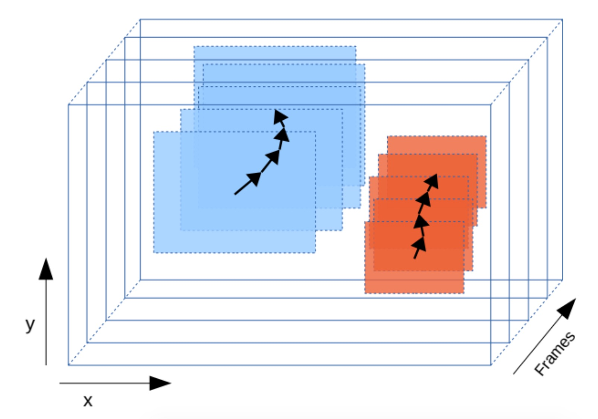
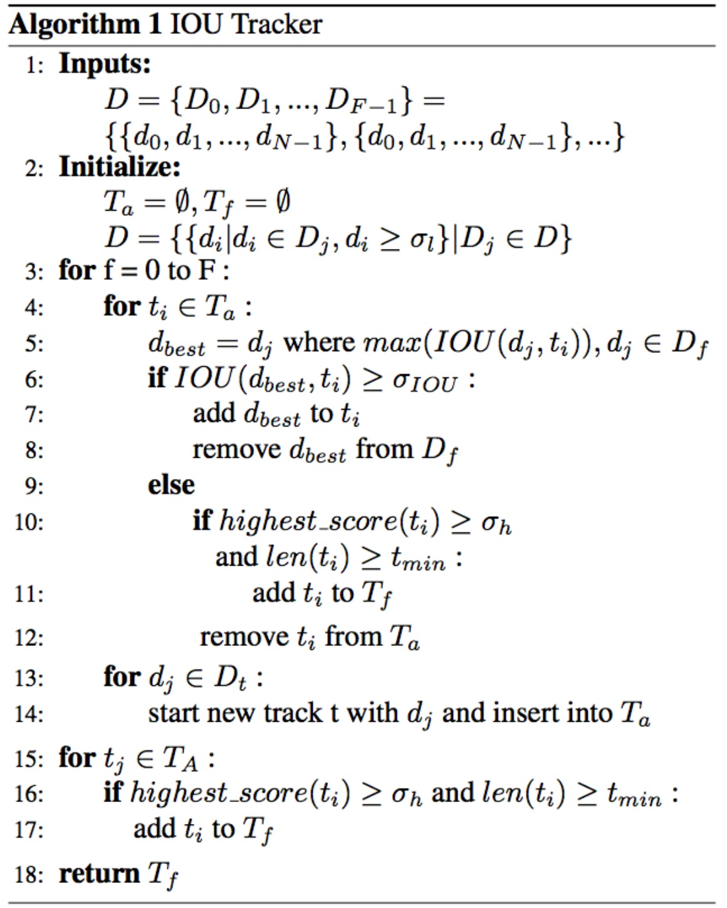
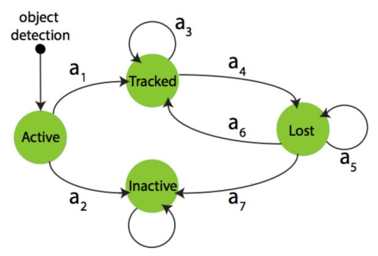
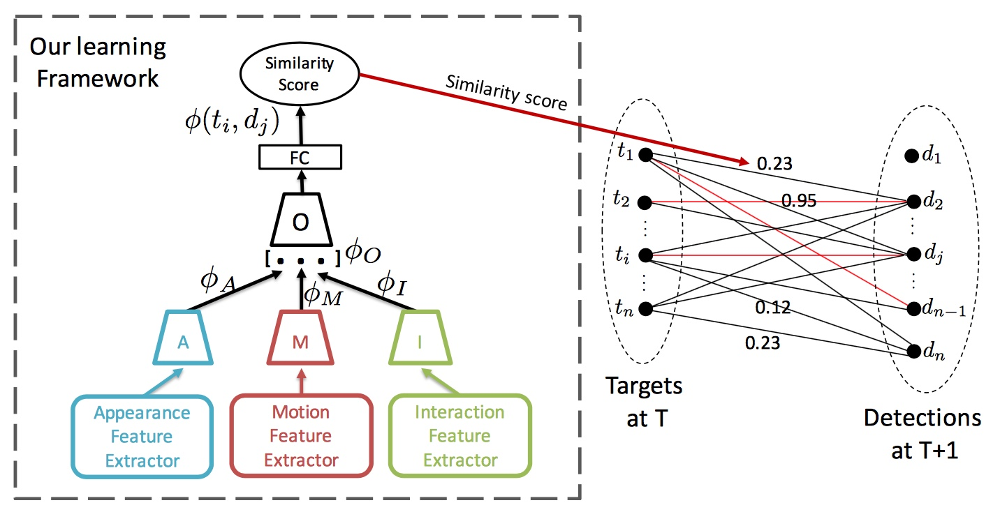
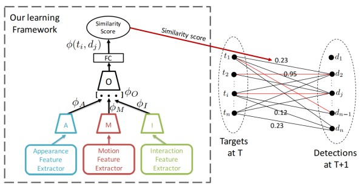

# ALL MOT CORE PAPERS

## CVPR 2017

- [Multiple People Tracking by Lifted Multicut and Person Re-Identification](http://openaccess.thecvf.com/content_cvpr_2017/papers/Tang_Multiple_People_Tracking_CVPR_2017_paper.pdf)

- [Multi-Object Tracking With Quadruplet Convolutional Neural Networks](http://openaccess.thecvf.com/content_cvpr_2017/papers/Son_Multi-Object_Tracking_With_CVPR_2017_paper.pdf)

- [ArtTrack: Articulated Multi-Person Tracking in the Wild](http://openaccess.thecvf.com/content_cvpr_2017/papers/Insafutdinov_ArtTrack_Articulated_Multi-Person_CVPR_2017_paper.pdf)

- [Deep Network Flow for Multi-Object Tracking](http://openaccess.thecvf.com/content_cvpr_2017/papers/Schulter_Deep_Network_Flow_CVPR_2017_paper.pdf)

- [PoseTrack: Joint Multi-Person Pose Estimation and Tracking](http://openaccess.thecvf.com/content_cvpr_2017/papers/Iqbal_PoseTrack_Joint_Multi-Person_CVPR_2017_paper.pdf)

- [Joint Graph Decomposition & Node Labeling: Problem, Algorithms, Applications](http://openaccess.thecvf.com/content_cvpr_2017/papers/Levinkov_Joint_Graph_Decomposition_CVPR_2017_paper.pdf)

## CVPR 2016

- [Beyond Local Search: Tracking Objects Everywhere with Instance-Specific Proposals](http://openaccess.thecvf.com/content_cvpr_2016/papers/Zhu_Beyond_Local_Search_CVPR_2016_paper.pdf)

- (**RANK 8, SCEA**)
 [Online Multi-Object Tracking via Structural Constraint Event Aggregation](http://openaccess.thecvf.com/content_cvpr_2016/papers/Yoon_Online_Multi-Object_Tracking_CVPR_2016_paper.pdf)

- [The Solution Path Algorithm for Identity-Aware Multi-Object Tracking](http://openaccess.thecvf.com/content_cvpr_2016/papers/Yu_The_Solution_Path_CVPR_2016_paper.pdf)

- [Multi-view People Tracking via Hierarchical Trajectory Composition](http://openaccess.thecvf.com/content_cvpr_2016/papers/Xu_Multi-View_People_Tracking_CVPR_2016_paper.pdf)

- [Social LSTM: Human Trajectory Prediction in Crowded Spaces](http://openaccess.thecvf.com/content_cvpr_2016/papers/Alahi_Social_LSTM_Human_CVPR_2016_paper.pdf)

## CVPR 2015

- [Target Identity-aware Network Flow for Online Multiple Target Tracking](http://openaccess.thecvf.com/content_cvpr_2015/papers/Dehghan_Target_Identity-Aware_Network_2015_CVPR_paper.pdf)

- [Joint Vanishing Point Extraction and Tracking](http://openaccess.thecvf.com/content_cvpr_2015/papers/Kroeger_Joint_Vanishing_Point_2015_CVPR_paper.pdf)

- [GMMCP Tracker: Globally Optimal Generalized Maximum Multi Clique Problem for Multiple Object Tracking](http://openaccess.thecvf.com/content_cvpr_2015/papers/Dehghan_GMMCP_Tracker_Globally_2015_CVPR_paper.pdf)

- [Subgraph Decomposition for Multi-Target Tracking](http://openaccess.thecvf.com/content_cvpr_2015/papers/Tang_Subgraph_Decomposition_for_2015_CVPR_paper.pdf)

- [On Pairwise Costs for Network Flow Multi-Object Tracking](http://openaccess.thecvf.com/content_cvpr_2015/papers/Chari_On_Pairwise_Costs_2015_CVPR_paper.pdf)

- [Multihypothesis Trajectory Analysis for Robust Visual Tracking](http://openaccess.thecvf.com/content_cvpr_2015/papers/Lee_Multihypothesis_Trajectory_Analysis_2015_CVPR_paper.pdf)

## CVPR 2014

- [Multi-Object Tracking via Constrained Sequential Labeling](http://openaccess.thecvf.com/content_cvpr_2014/papers/Chen_Multi-Object_Tracking_via_2014_CVPR_paper.pdf)

- [Robust Online Multi-Object Tracking based on Tracklet Confidence and Online Discriminative Appearance Learning](http://openaccess.thecvf.com/content_cvpr_2014/papers/Bae_Robust_Online_Multi-Object_2014_CVPR_paper.pdf)

- [An Online Learned Elementary Grouping Model for Multi-target Tracking](http://openaccess.thecvf.com/content_cvpr_2014/papers/Chen_An_Online_Learned_2014_CVPR_paper.pdf)

- [Multiple Target Tracking Based on Undirected Hierarchical Relation Hypergraph](http://openaccess.thecvf.com/content_cvpr_2014/papers/Wen_Multiple_Target_Tracking_2014_CVPR_paper.pdf)

- [Bi-label Propagation for Generic Multiple Object Tracking](http://openaccess.thecvf.com/content_cvpr_2014/papers/Luo_Bi-label_Propagation_for_2014_CVPR_paper.pdf)

- [A Probabilistic Framework for Multitarget Tracking with Mutual Occlusions](http://openaccess.thecvf.com/content_cvpr_2014/papers/Yang_A_Probabilistic_Framework_2014_CVPR_paper.pdf)

- [Occlusion Geodesics for Online Multi-Object Tracking](http://openaccess.thecvf.com/content_cvpr_2014/papers/Possegger_Occlusion_Geodesics_for_2014_CVPR_paper.pdf)

- [Multi-target Tracking with Motion Context in Tensor Power Iteration](http://openaccess.thecvf.com/content_cvpr_2014/papers/Shi_Multi-target_Tracking_with_2014_CVPR_paper.pdf)

- [Learning an Image-based Motion Context for Multiple People Tracking](http://openaccess.thecvf.com/content_cvpr_2014/papers/Leal-Taixe_Learning_an_Image-based_2014_CVPR_paper.pdf)

- [Speeding Up Tracking by Ignoring Features](http://openaccess.thecvf.com/content_cvpr_2014/papers/Zhang_Speeding_Up_Tracking_2014_CVPR_paper.pdf)

## CVPR 2013

- [Multi-target Tracking by Lagrangian Relaxation to Min-cost Network Flow](http://openaccess.thecvf.com/content_cvpr_2013/papers/Butt_Multi-target_Tracking_by_2013_CVPR_paper.pdf)

- [Multi-target Tracking by Rank-1 Tensor Approximation](http://openaccess.thecvf.com/content_cvpr_2013/papers/Shi_Multi-target_Tracking_by_2013_CVPR_paper.pdf)

- [Information Consensus for Distributed Multi-target Tracking](http://openaccess.thecvf.com/content_cvpr_2013/papers/Kamal_Information_Consensus_for_2013_CVPR_paper.pdf)

- [Harry Potter's Marauder's Map: Localizing and Tracking Multiple Persons-of-Interest by Nonnegative Discretization](http://openaccess.thecvf.com/content_cvpr_2013/papers/Yu_Harry_Potters_Marauders_2013_CVPR_paper.pdf)

- [Robust Real-Time Tracking of Multiple Objects by Volumetric Mass Densities](http://openaccess.thecvf.com/content_cvpr_2013/papers/Possegger_Robust_Real-Time_Tracking_2013_CVPR_paper.pdf)

- [Tracking Sports Players with Context-Conditioned Motion Models](http://openaccess.thecvf.com/content_cvpr_2013/papers/Liu_Tracking_Sports_Players_2013_CVPR_paper.pdf)

- [Hypergraphs for Joint Multi-view Reconstruction and Multi-object Tracking](http://openaccess.thecvf.com/content_cvpr_2013/papers/Hofmann_Hypergraphs_for_Joint_2013_CVPR_paper.pdf)

- [Detection- and Trajectory-Level Exclusion in Multiple Object Tracking](http://openaccess.thecvf.com/content_cvpr_2013/papers/Milan_Detection-_and_Trajectory-Level_2013_CVPR_paper.pdf)

- [Tracking People and Their Objects](http://openaccess.thecvf.com/content_cvpr_2013/papers/Baumgartner_Tracking_People_and_2013_CVPR_paper.pdf)

## ICCV 2015

- (**RANK 3, NOMP**)
 [Near-Online Multi-Target Tracking With Aggregated Local Flow Descriptor](http://openaccess.thecvf.com/content_iccv_2015/papers/Choi_Near-Online_Multi-Target_Tracking_ICCV_2015_paper.pdf)

- (**RANK 5, MHT_DAM**)
 [Multiple Hypothesis Tracking Revisited](http://openaccess.thecvf.com/content_iccv_2015/papers/Kim_Multiple_Hypothesis_Tracking_ICCV_2015_paper.pdf)

- (**RANK 6, MDP**)
 [Learning to Track: Online Multi-Object Tracking by Decision Making](http://openaccess.thecvf.com/content_iccv_2015/papers/Xiang_Learning_to_Track_ICCV_2015_paper.pdf)

- [Unsupervised Object Discovery and Tracking in Video Collections](http://openaccess.thecvf.com/content_iccv_2015/papers/Kwak_Unsupervised_Object_Discovery_ICCV_2015_paper.pdf)

- [FollowMe: Efficient Online Min-Cost Flow Tracking with Bounded Memory and Computation](http://openaccess.thecvf.com/content_iccv_2015/papers/Lenz_FollowMe_Efficient_Online_ICCV_2015_paper.pdf)

- [Learning to Divide and Conquer for Online Multi-Target Tracking](http://openaccess.thecvf.com/content_iccv_2015/papers/Solera_Learning_to_Divide_ICCV_2015_paper.pdf)

## ICCV 2013

- [Latent Data Association: Bayesian Model Selection for Multi-target Tracking](http://openaccess.thecvf.com/content_iccv_2013/papers/Segal_Latent_Data_Association_2013_ICCV_paper.pdf)

- [Tracking via Robust Multi-task Multi-view Joint Sparse Representation](http://openaccess.thecvf.com/content_iccv_2013/papers/Hong_Tracking_via_Robust_2013_ICCV_paper.pdf)

- [The Way They Move: Tracking Multiple Targets with Similar Appearance](http://openaccess.thecvf.com/content_iccv_2013/papers/Dicle_The_Way_They_2013_ICCV_paper.pdf)

- [Learning People Detectors for Tracking in Crowded Scenes](http://openaccess.thecvf.com/content_iccv_2013/papers/Tang_Learning_People_Detectors_2013_ICCV_paper.pdf)

- [Higher Order Matching for Consistent Multiple Target Tracking](http://openaccess.thecvf.com/content_iccv_2013/papers/Arora_Higher_Order_Matching_2013_ICCV_paper.pdf)

- [Discriminative Label Propagation for Multi-object Tracking with Sporadic Appearance Features](http://openaccess.thecvf.com/content_iccv_2013/papers/Kumar_Discriminative_Label_Propagation_2013_ICCV_paper.pdf)

- [Topology-Constrained Layered Tracking with Latent Flow](http://openaccess.thecvf.com/content_iccv_2013/papers/Chang_Topology-Constrained_Layered_Tracking_2013_ICCV_paper.pdf)

## Others 2017

- (Arxiv 2017)
 [Tracking the Trackers: An Analysis of the State of the Art in Multiple Object Tracking](https://arxiv.org/pdf/1704.02781.pdf)

- (AAAI 2017)
 [Online Multi-Target Tracking Using Recurrent Neural Networks](http://www.milanton.de/files/aaai2017/aaai2017-anton-rnntracking.pdf)

- (ICML 2017)
 [Analysis and Optimization of Graph Decompositions by Lifted Multicuts](https://arxiv.org/pdf/1503.03791)

- (Arxiv 2017)
 [NoScope: Optimizing Neural Network Queries over Video at Scale](https://arxiv.org/abs/1703.02529)

- (Arxiv 2017)
 [Simple Online and Realtime Tracking with a Deep Association Metric](https://arxiv.org/pdf/1703.07402)

- (ICIP 2017)
 [Instance Flow Based Online Multiple Object Tracking](https://arxiv.org/pdf/1703.01289v2)

- (**RANK 1, MDPNN**, Arxiv 2017)
 [Tracking The Untrackable: Learning To Track Multiple Cues with Long-Term Dependencies](https://arxiv.org/pdf/1701.01909)

- (**RANK 2, TSMLCDEnew**, PAMI 2017)
 [Tracklet Association by Online Target-Specific Metric Learning and Coherent Dynamics Estimation](https://arxiv.org/pdf/1511.06654)

## Others 2016

- (Arxiv 2016)
 [On The Stability of Video Detection and Tracking](https://arxiv.org/pdf/1611.06467)

- (ECCV 2016 workshop)
 [POI: Multiple Object Tracking with High Performance Detection and Appearance Feature](https://arxiv.org/pdf/1610.06136v1)

 - (Arxiv 2016) [Spatially Supervised Recurrent Convolutional Neural Networks for Visual Object Tracking](https://arxiv.org/pdf/1607.05781)

 - (**RANK 4, TDAM**, CVIU 2016)
 [Temporal Dynamic Appearance Modeling for Online Multi-Person Tracking](https://arxiv.org/pdf/1510.02906)

- (**RANK 7, CNNTCM**, CVPR 2016 Workshop)
 [Joint Learning of Siamese CNNs and Temporally Constrained Metrics for Tracklet Association](https://arxiv.org/pdf/1605.04502)

- (**RANK 9, SiameseCNN**, CVPR 2016 Workshop)
 [Learning by tracking: Siamese CNN for robust target association](https://arxiv.org/pdf/1604.07866)

- (**RANK 10, TbX**, Arxiv 2016)
 [Tracking with multi-level features](https://arxiv.org/pdf/1607.07304)

## Surveys

- (Arxiv 2017)
 [Tracking the Trackers: An Analysis of the State of the Art in Multiple Object Tracking](https://arxiv.org/pdf/1704.02781.pdf)

# MOT method rankings

Ordered based on their overall performance ranking on [MOT](https://motchallenge.net/) challenges.

## MOT 2017

1. (FWT, Arxiv 2017) [Improvements to Frank-Wolfe optimization for multi-detector multi-object tracking](https://arxiv.org/pdf/1705.08314)

2. (jCC, Arxiv 2016) [A Multi-cut Formulation for Joint Segmentation and Tracking of Multiple Objects](https://arxiv.org/pdf/1607.06317)

3. (MHT_DAM, ICCV 2015) [Multiple Hypothesis Tracking Revisited](https://web.engr.oregonstate.edu/~lif/MHT_ICCV15.pdf)

4. (EDMT17, CVPRw 2017) [Enhancing Detection Model for Multiple Hypothesis Tracking](http://openaccess.thecvf.com/content_cvpr_2017_workshops/w34/papers/Chen_Enhancing_Detection_Model_CVPR_2017_paper.pdf)

5. (IOU17, AVSS 2017) [High-Speed Tracking-by-Detection Without Using Image Information](http://elvera.nue.tu-berlin.de/files/1517Bochinski2017.pdf)

## MOT 2016

1. (LMP, CVPR 2017) [Multiple People Tracking with Lifted Multicut and Person Re-identification](http://openaccess.thecvf.com/content_cvpr_2017/papers/Tang_Multiple_People_Tracking_CVPR_2017_paper.pdf)

2. (FWT, Arxiv 2017) [Improvements to Frank-Wolfe optimization for multi-detector multi-object tracking](https://arxiv.org/pdf/1705.08314)

3. (NLLMPa, CVPR 2017) [Joint Graph Decomposition and Node Labeling: Problem, Algorithms, Applications](https://arxiv.org/pdf/1611.04399)

4. (AMIR, Arxiv 2017) [Tracking The Untrackable: Learning To Track Multiple Cues with Long-Term Dependencies](https://arxiv.org/pdf/1701.01909)

5. (MCjoint, CoRR 2016) [A Multi-cut Formulation for Joint Segmentation and Tracking of Multiple Objects](https://arxiv.org/pdf/1607.06317)

6. (NOMT, ICCV 2015) [Near-Online Multi-target Tracking with Aggregated Local Flow Descriptor](https://arxiv.org/pdf/1504.02340)

7. (JMC, BMTT 2016) [Multi-Person Tracking by Multicuts and Deep Matching](https://arxiv.org/pdf/1608.05404)

8. (STAM16, Arxiv 2017) [Online Multi-Object Tracking Using CNN-based Single Object Tracker with Spatial-Temporal Attention Mechanism](https://arxiv.org/pdf/1708.02843)

9. (MHT_DAM, ICCV 2015) [Multiple Hypothesis Tracking Revisited](https://web.engr.oregonstate.edu/~lif/MHT_ICCV15.pdf)

10. (EDMT, CVPRw 2017) [Enhancing Detection Model for Multiple Hypothesis Tracking](http://openaccess.thecvf.com/content_cvpr_2017_workshops/w34/papers/Chen_Enhancing_Detection_Model_CVPR_2017_paper.pdf)

11. (QuadMOT16, CVPR 2017) [Multi-Object Tracking with Quadruplet Convolutional Neural Networks](http://openaccess.thecvf.com/content_cvpr_2017/papers/Son_Multi-Object_Tracking_With_CVPR_2017_paper.pdf)

12. (oICF, AVSS 2016) [Online multi-person tracking using Integral Channel Features](http://ieeexplore.ieee.org/document/7738059/)

## MOT 2015

1. (AMIR15, Arxiv 2017) [Tracking The Untrackable: Learning To Track Multiple Cues with Long-Term Dependencies](https://arxiv.org/pdf/1701.01909)

2. (JointMC, CoRR 2016) [A Multi-cut Formulation for Joint Segmentation and Tracking of Multiple Objects](https://arxiv.org/pdf/1607.06317)

3. (HybridDAT, TIP 2016) [A Hybrid Data Association Framework for Robust Online Multi-Object Tracking](https://arxiv.org/pdf/1703.10764)

4. (AM, Arxiv 2017) [Online Multi-Object Tracking Using CNN-based Single Object Tracker with Spatial-Temporal Attention Mechanism](https://arxiv.org/pdf/1708.02843)

5. (TSMLCDEnew, Arxiv 2015) [Tracklet Association by Online Target-Specific Metric Learning and Coherent Dynamics Estimation](https://arxiv.org/pdf/1511.06654)

6. (QuadMOT, CVPR 2017) [Multi-Object Tracking with Quadruplet Convolutional Neural Networks](http://openaccess.thecvf.com/content_cvpr_2017/papers/Son_Multi-Object_Tracking_With_CVPR_2017_paper.pdf)

7. (NOMT, ICCV 2015) [Near-Online Multi-target Tracking with Aggregated Local Flow Descriptor](https://arxiv.org/pdf/1504.02340)

8. (TDAM, CVIU 2016) [Temporal Dynamic Appearance Modeling for Online Multi-Person Tracking](https://arxiv.org/pdf/1510.02906)

9. (MHT_DAM, ICCV 2015) [Multiple Hypothesis Tracking Revisited](http://openaccess.thecvf.com/content_iccv_2015/papers/Kim_Multiple_Hypothesis_Tracking_ICCV_2015_paper.pdf)

10. (MDP, ICCV 2015) [Learning to Track: Online Multi-Object Tracking by Decision Making](http://openaccess.thecvf.com/content_iccv_2015/papers/Xiang_Learning_to_Track_ICCV_2015_paper.pdf)

11. (CNNTCM, CVPRw 2016) [Joint Learning of Siamese CNNs and Temporally Constrained Metrics for Tracklet Association](https://arxiv.org/pdf/1605.04502)

12. (SCEA, CVPR 2016) [Online Multi-Object Tracking via Structural Constraint Event Aggregation](http://openaccess.thecvf.com/content_cvpr_2016/papers/Yoon_Online_Multi-Object_Tracking_CVPR_2016_paper.pdf)

13. (SiameseCNN, CVPRw 2016) [Learning by tracking: Siamese CNN for robust target association](https://arxiv.org/pdf/1604.07866)

14. (TBX, Arxiv 2016) [Tracking with multi-level features](https://arxiv.org/pdf/1607.07304)

15. (oICF, AVSS 2016) [Online multi-person tracking using Integral Channel Features](http://ieeexplore.ieee.org/document/7738059/)

16. (TO, WACV 2016) [Leveraging single for multi-target tracking using a novel trajectory overlap affinity measure](https://lirias.kuleuven.be/bitstream/123456789/575403/1/4199_postprint.pdf)

# References

This repository contains references for papers and code for the Multiple Object Tracking 2017 (MOT17) project. To reduce the repository size, most documents are provided as links.

## Papers

### Most Relevant

* (ECCV16) Simple Online and Realtime Tracking with a Deep Association Metric. [\[pdf\]](https://arxiv.org/pdf/1703.07402) [\[code\]](https://github.com/nwojke/deep_sort)

* (Arxiv17) NoScope: 1000x Faster Deep Learning Queries over Video. [\[project\]](http://dawn.cs.stanford.edu/2017/06/22/noscope/) [\[pdf\]](https://arxiv.org/pdf/1703.02529) [\[code\]](https://github.com/stanford-futuredata/noscope)

* (ICCV17) Focal Loss for Dense Object Detection. [\[pdf\]](https://arxiv.org/pdf/1708.02002)

* (Arxiv16) On The Stability of Video Detection and Tracking. [\[pdf\]](https://arxiv.org/pdf/1611.06467)

* (Arxiv17) Optimizing Deep CNN-Based Queries over Video Streams at Scale. [\[pdf\]](https://arxiv.org/pdf/1703.02529) [\[code\]](https://github.com/stanford-futuredata/tensorflow-noscope)

* (CVPR13) Visual Tracking via Locality Sensitive Histograms. [\[project\]](http://www.shengfenghe.com/visual-tracking-via-locality-sensitive-histograms.html) [\[pdf\]](http://www.shengfenghe.com/uploads/1/5/1/3/15132160/lsh_tracking_cvpr2013.pdf) [\[code\]](http://www.shengfenghe.com/uploads/1/5/1/3/15132160/lsh_tracking_color_img.zip)

### CVPR 2017

* (CVPR17) A Multi-cut Formulation for Joint Segmentation and Tracking of Multiple Objects. [\[pdf\]](https://arxiv.org/pdf/1607.06317)

* (CVPR17) Joint Graph Decomposition and Node Labeling: Problem, Algorithms, Applications. [\[pdf\]](https://arxiv.org/pdf/1611.04399)

* (CVPR17) Multiple People Tracking by Lifted Multicut and Person Re-identification. [\[pdf\]](http://openaccess.thecvf.com/content_cvpr_2017/papers/Tang_Multiple_People_Tracking_CVPR_2017_paper.pdf)

* (ICML17) Analysis and Optimization of Graph Decompositions by Lifted Multicuts. [\[pdf\]](https://arxiv.org/pdf/1503.03791)

* (CVPR17) Densely Connected Convolutional Networks. [\[pdf\]](https://arxiv.org/pdf/1608.06993) [\[code\]](https://github.com/liuzhuang13/DenseNet)

* (CVPR17) Feature Pyramid Networks for Object Detection. [\[pdf\]](https://arxiv.org/pdf/1612.03144)

# Notes on Multiple Object Tracking: Part 1

Given a video contains moving objects of a specific class (e.g., pedestrian, vehicles, etc.), the task of multiple object tracking (MOT) is to locate all the objects of interest and associate them to find their correspondence across time.

Tracking-by-detection is recently the most successful paradigm among MOT methods. The paradigm separate tracking into two stages. First, an object detector is applied to each video frame. In a second step, a tracker is used to associate these detections to *tracks*. This note makes a survey of tracking-by-detection methods, where the input is a video and all the detections, and the output is the tracking results.

Lets first refer to a very simple basic implementation of multiple object tracking, and see what problems it may produce and try to improve this implementation.

(**Note:** For clarity, we name the objects we have tracked over time, i.e. frame 1~t, as *tracks* and the unassociated ones detected in a new frame, i.e. frame t+1, as *detections*)

## 1. A Basic Tracker

A simple and intuitive idea is to associate the detections in consecutive frames by their spatial overlap between time steps. The detections with the highest IOU (Intersection-Over-Union) could probably belong to the same object. This gets closer to the truth when the frame rate is high and when the detector becomes increasingly reliable.

With the basic idea, we complete the implementation by answering the following questions.

1. How to find the correspondence between last *tracks* and new *detections*?

    A greedy method. For a *track*, we compute its IOUs with all the *detections*. If the max IOU is bigger than a threshold (e.g. 0.5), we add the *detection* to the *track*, then remove it from the *detections* set. We loop over all the *tracks* to find their corresponding *detections*.

2. How to determine the initialization and the termination of a *track*?

    An unassociated *detection* is initialized as a new *track*, and a *track* without corresponding *detection* will be removed (i.e. a termination).

3. How to filter out the false positives in detections?

    By removing: 1. short tracks (filtering out all tracks with a length shorter than a number, e.g. 3). 2. low scoring tracks (remove all tracks without at least one detection with a score above a number, e.g. 0.3).

4. How to improve the completeness of a *track*?

    The key is the use of low scoring detections. *"Requiring a track to have at least one high-scoring detection ensures that the track belongs to a true object of interest while benefiting from lowscoring detections for the completeness of the track."*

The simple implementation forms our first reviewed paper with its code publicly available:

* *E. Bochinski, V. Eiselein and T. Sikora, ``High-speed tracking-by-detection without using image information'', AVSS 2017.* [\[pdf\]](http://elvera.nue.tu-berlin.de/files/1517Bochinski2017.pdf) [\[code\]](https://github.com/bochinski/iou-tracker)

Despite its simpleness, it runs very fast (100K fps) and still achieves an average rank 7.2 on MOT17 with MOTA score 45.5 (with EB detector, see [here](https://motchallenge.net/tracker/IOU17) for details).

## 2. Appearance and Motion Models

The basic tracker is efficient but vulnerable, i.e., an occlusion or a missing of a detection will terminate a track imediately; when the objects/camera move fast or when the frame rate is low, the IOUs between correponding detections would be small or even close to 0, and the costs/similarity scores become less reliable. Moreover, the greedy assignment process is problematic when interactions or mutual occlusions happen among close objects.

Revisiting the basic tracker, we could find several algorithm modules: the intialization and termination processes, a pair-wise cost function (IOU criterion) and an assignment process (a greedy method for finding the correspondences). Before we start designing a better tracking algorithm, let's list out the modules we'd like to improve:

We'd like to:

- reduce the false positives (wrong detections) in the **initialization** process, and the false negatives (occlusions or missing detections) in the **termination** process. (**- by lazy evaluation**)

- improve the **pair-wise cost/similarity functions**. (**- by introducing appearance and motion models**)

- choose a better optimizer for the assignment problem instead the greedy solver. (**- by the Hungarian algorithm**)

Now let's start the designing.

1. Initialization.

    Tentative. After 3 frames of detections, change to Active.

2. Termination.

    Only after 30 frames of lost, mark as lost.

3. Appearance Model.

    Siamese CNN.

4. Motion Model.

    Kalman Filters.

5. Pair-wise Similarity.

    Siamese CNN score. IOU with Kalman predicted box.

6. Assignment Problem Solver.

    Hungarian Algorithm.

The above briefs the *deepsort* algrithm of the following paper (source code available):

* *W. Nicolai, B. Alex and P. Dietrich, ``Simple Online and Realtime Tracking with a Deep Association Metric'', Arxiv 2017.* [\[pdf\]](https://arxiv.org/pdf/1703.07402.pdf) [\[code\]](https://github.com/nwojke/deep_sort)

The deepsort algorithm runs at approximately 40Hz and achieves an MOTA 61.4 with high performance detections (see [here](https://arxiv.org/abs/1610.06136)).

## 3. Rethinking The State Transitions of An Object

So far, we treat the initialization, termination, lost and rediscover of objects as trivial problems that were solved by some hand-craft simple tricks. Let's revisit the state changes of an object in a different perspective.

There are only four possible states for an object during tracking: appearance, disappearance, tracked, lost. An object that is lost might be rediscovered in later frames, while the one that is determined as disappeared is considered never to come back to the scene again. Therefore, the lifetime of an object could be modeled as transitions among its four possible states, which is exactly: the **Markov Decision Process (MDP)**.

The MDP consists of the tuple (`S`, `A`, `T`, `R`), where `S` is the state set, `A` denotes the action set, `T`: `S` x `A` -> `S` is the state transition function descibes the effect of each action in each state, `R`: `S` x `A` -> `R` denotes the real-valued reward function, it defines the immediate reward received after executing action a to state s. Name the "appearance" and "disappearance" states as "Active" and "Inactive", the possible transitions between the four states are dispicted in the above figure. Only seven transitions/actions are possible.

In MDP, a policy π is a mapping from the state space `S` to the action space `A`, i.e., π : `S` -> `A`. So the rest tasks is to define the policies in three states (excluding the `Inactive` state since an inactive object will never appear again).

1. Policy in an Active State

2. Policy in a Tracked State

3. Policy in a Lost State

The idea is originated in the following paper, with public source code available:

* *Xiang, Yu and Alahi, Alexandre and Savarese, Silvio, ``Learning to Track: Online Multi-Object Tracking by Decision Making'', ICCV 2015.* [\[pdf\]](http://cvgl.stanford.edu/papers/xiang_iccv15.pdf) [\[code\]](https://github.com/yuxng/MDP_Tracking)

## 4. Rethinking The Features

How many features can we extract and utilize to associate *tracks* with *detections*, or to determine the pair-wise similarity/cost between a *track* and a *detection*?

1. Appearance Features

2. Motion Features

3. Interaction Features

* *A. Sadeghian, A. Alahi and S. Savarese, ``Tracking The Untrackable: Learning To Track Multiple Cues with Long-Term Dependencies'', CVPR 2017.* [\[pdf\]](http://arxiv.org/pdf/1701.01909.pdf) [\[project\]](http://web.stanford.edu/~alahi/)

## 5. Rethinking The Assignment Problem

MultiCut. Linear Programing + xxx. Node labeling and graph decomposition. etc.

## 6. Tracklet Association

## 7. An End-to-End Fasion

# Notes on Multiple Object Tracking: Part 2

Random notes.

<!--
Paper Note ID: 1
-->
## Tracking The Untrackable: Learning to Track Multiple Cues with Long-Term Dependencies (Arxiv 2017)

### Overview

Features used in multiple object tracking (MOT) include no more than appearance, motion and interaction features. Two questions need to be asked before using them in MOT:

1. How to combine the features?
2. How to model long term dependencies?

This paper studies the above problems.

Note in MOT, there are **objects** that we have continuously tracked through frame 1~t, and **detections** in frame t+1 that we wish to assign them to the tracked objects. 

This paper models the appearance, motion and interaction models independently as RNNs (marked as **module RNN**), then the outputs of the three RNNs are feeded to yet another RNN (marked as **target RNN**) to generate similarity scores between objects and detections. With the similarity (cost) matrix obtained, the assignment problem is solved by the Hungarian algorithm.

1. The module RNN solves the problem of long term dependencies.
2. The target RNN solves the problem of feature selection/combination.

### Details

All the following RNNs are LSTMs.

1. **Appearance Model**

Basic input feature: raw content.

CNN followed by an RNN for **object** feature extraction. Then the **object** feature is concatenated with **detection** CNN feature, and feeded to fully connected layers to generate a final k dimentional appearance feature.

2. **Motion Model**

Basic input feature: velocity vector (vx, vy).

An RNN that accepts as inputs the velocity vector for extracting the H dimentional **object** feature, and a fully connected layer for extracting **detection** feature. The two features are concatenated and feeded to a FCN layer to generate a final k dimentional motion feature.

3. **Interaction Model**

Basic input feature: flattened occupancy grid. Separate image into equal grids and neighboring grids of an object are annotated as 1 if there is another target, otherwise 0.

An RNN that accepts as inputs the flattened occupancy grid for extracting the H dimentional **object** feature, and the FCN layer for extracting **detection** feature. The two features are concatenated and feeded to a FCN layer to generate a final k dimentional interaction feature.

4. **Target Model**

An RNN followed by FCN layers that accepts as inputs the concatenated 3k dimentional features as outputs the similarity score between an **object** and a **detection**.

5. **Training Process**

First, each RNN as well as the CNN is pre-trained separately with a standard softmax classifier and cross-entropy loss, positive indicates matched object and detection and negative otherwise. Second, the target RNN is jonitly trained end-to-end with the component RNNs.

### Effectiveness

MOTA 47.2 on MOT16 and 37.6 on 2DMOT15, runs at 1 Hz.

Reports that the history (long-term dependencies in LSTMs) works, the combination works, and each cue matters.

<!--
Paper Note ID: 2
-->
## Learning to Track: Online Multi-Object Tracking by Decision Making (MDP, ICCV 2015)

### Overview

Each object in MOT may fall in on of four states: active, inactive, tracked, lost.

- **Active**: initial state of any target. Whenever an object is detected.
- **Tracked**: confirmed as a true positive from an object detector.
- **Lost**: the target is lost due to some reasons like occlusion, out of view or disappear.
- **Inactive**: the target is confirmed lost, and stay inactive forever.

The paper formulates the MOT as decision making in Markov Decision Processes (MDPs).

- **State Space**: the four states active, inactive, tracked, lost.
- **Action Space**: feasible trasitions from one state to another.
- **Transition Function**: describes the effect of each action in each state.
- **Reword Funtion**: defines reward received after executing an action to a state.

The rest of the paper is to design reward functions (sometimes trainable models) for seven possible transitions in the state space.

The main contribution of the paper is it proposed a framework for modeling the object states and its state transitions.
